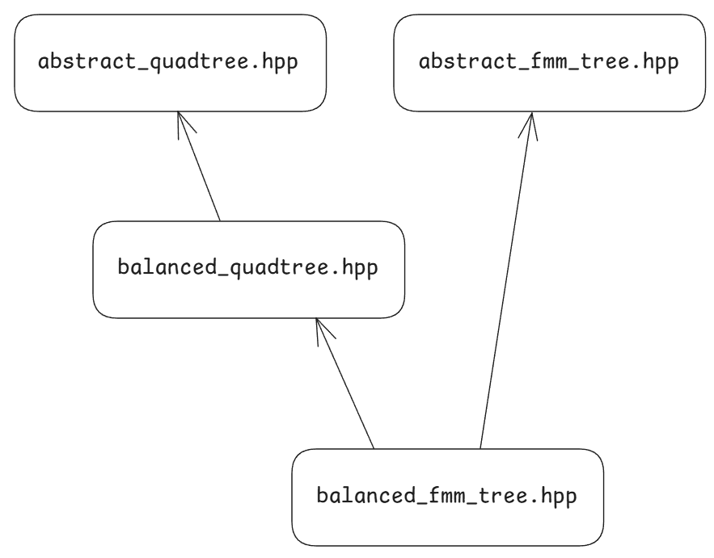

# Build & Run Guide

## 1. Prerequisites

- **CMake** ≥ 3.12  
- **g++-8** (or another C++17 compiler)  
- **GSL** (GNU Scientific Library)

Install dependencies (on Ubuntu):

```sh
sudo apt update
sudo apt install cmake g++-8 libgsl-dev valgrind linux-tools-common linux-tools-generic
```

## 2. Clone the Repository

```sh
git clone git@github.com:AMSC-24-25/06-nbody-06-nbody.git
cd 06-nbody-06-nbody
```

## 3. Build the Project

```sh
cd tests # Change to the tests directory
mkdir build # Create a build directory
cd build # Change to the build directory
cmake .. # Configure the project
make # Build the project
```

## 4. Run the Tests

After building, three main executables are created:

- `integrator_leapfrog_2d`
- `accuracy_test`
- `efficiency_test`
  
To run them directly:

```sh
./integrator_leapfrog_2d
./accuracy_test
./efficiency_test
```

Or use the custom CMake targets (from the build directory):

```sh
make run_integrator_leapfrog_2d
make run_accuracy_test
make run_efficiency_test
```

## 5. Project Structure

The project is organized as follows:

- `include/` - Header files
- `tests/` - Test files
  - `integration/` - Integration tests
  - `accuracy/` - Accuracy tests
  - `efficiency/` - Efficiency tests
- `CMakeLists.txt` - CMake configuration file

And the tree related classes have this kind of structure:


