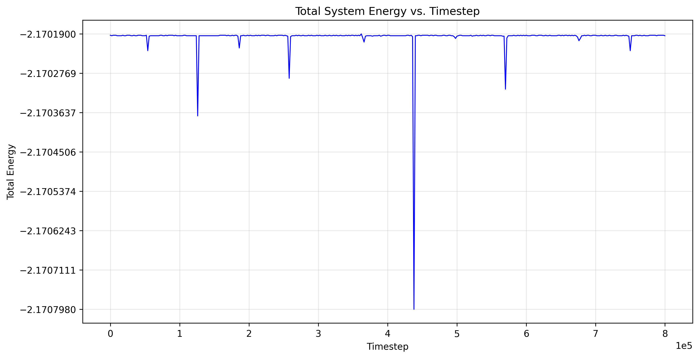
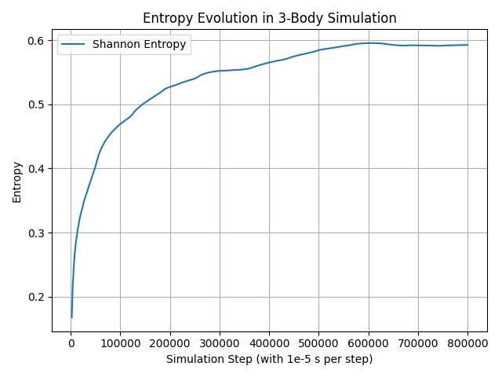
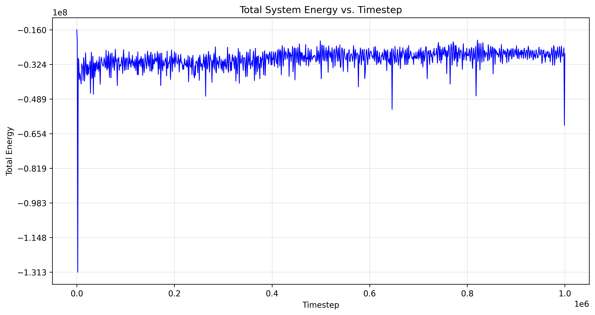
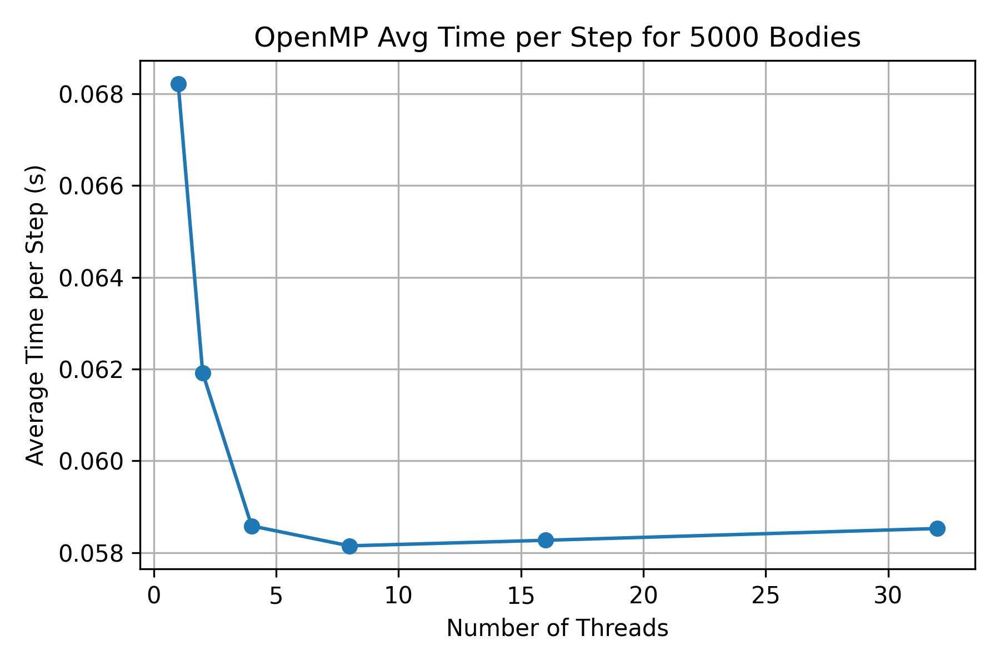

# 🌌 Barnes-Hut method using OpenMP

Both **serial** and **OpenMP-parallelized CPU** versions of the Barnes-Hut N-Body simulation are implemented in this branch.

## 🧠 Description

- Organizes space into a tree (e.g., quad-tree in 2D, octree in 3D) for grouping distant particles. This branch uses a 2D quad-tree implementation.
- Distant particle groups are treated as single "pseudo-particles" using their center of mass based ont the parameter `theta`, which defines the threshold for grouping particles.

## 🧪 How to Run

### 🔧 Prerequisites

- A C++ compiler with OpenMP support (e.g., `g++` or `clang++`)

### 🛠️ Compilation

This project provides both serial and OpenMP-accelerated Barnes-Hut N-Body simulations. Example test codes are available in the `tests/BH_test` folder.

#### Serial Version Compilation

Just use cmake, the current CMakeLists.txt is set up to only compile the serial barnes-hut implementation, here are demands to run:

```bash
# first go the the tests/BH_test directory then:
mkdir build
cd build
cmake ..
make
./bh_test
```

#### OpenMP Version Compilation

Go to the `tests/BH_test` directory and compile the OpenMP version of the Barnes-Hut simulation as follows:

```bash
# 1. Generate the initial condition file (e.g., for 5000 bodies):
g++ GenerateBodies.cpp -o generate_bodies
./generate_bodies 5000 generated_bodies_5000.txt

# 2. Compile and run the OpenMP-based simulation:
g++-14 -fopenmp -O2 BH_test_openmp.cpp -I../../include -o bh_openmp
OMP_NUM_THREADS=1 ./bh_openmp
OMP_NUM_THREADS=2 ./bh_openmp
OMP_NUM_THREADS=4 ./bh_openmp
OMP_NUM_THREADS=8 ./bh_openmp
OMP_NUM_THREADS=16 ./bh_openmp

# 3. Plot runtime performance using the generated CSV:
python3 Plot_openmp_threads.py
```

### 📄 Input File Format

The input file for initial positions should contain:

```txt
N
m1
x1 y1
vx1 vy1
m2
x2 y2
vx2 vy2
...
mN
xN yN
vxN vyN
```

Where:

- `N` is the number of particles  
- `mK` is the k-th body mass  
- `xK yK` is the k-th body initial position  
- `vxK vyK` is the k-th body initial velocity

### 🔎 Output

The program can output:

- Position of each body per timestep  
- Total energy and entropy per timestep
- CSV summary files for plotting performance metrics

#### Example Output For Serial Version

Here we just show the periodic orbit  three body problem, with the `\theta` parameter set to `0.1`, `maxleaves` to `4` and the initial date as follows:

```cpp
std::vector<PlanetData> planets = {
        {"A", 1.0, -1.0, 0.0, 0.3068934205, 0.1255065670},
        {"B", 1.0, 1.0, 0.0, 0.3068934205, 0.1255065670},
        {"C", 1.0, 0.0, 0.0, -2 * 0.3068934205, -2 * 0.1255065670}};
```

Then we can get the result of the simulation as follows (orbits, energy and entropy):

- Orbits of the three bodies:

Actually, with current parameters, the barnes-hut just degerates the brute force method without any apprximation, so that the result is with little errors.


- Energy evaluation over time:

From the energy evaluation, we can see that the total energy is conserved, which is expected for a closed system.



- Entropy evaluation over time:

Finally, the entropy evaluation shows that the system reaches a stable state after experiencing the end of first periodic orbit, indicating that the system has reached a stable configuration without new information being added or lost. We can tell from the plot that period is about 6s, after which point the curve becomes almost flatten.



### Example Output For OpenMP Version

The OpenMP version has the better performance so that need to precess the large number of bodies, e.g., 5000 bodies, and the results can be found in the related files with openmp mark.

- **Correctness:**
  the energy plot `energy_evolution_openmp.png` is tested with 50 collisionless bodies to verify the correctness of the OpenMP version, which is similar to the serial version, showing that the total energy is conserved over time.



- **Performance:**
  Anyway, after comfiming the correctness of the OpenMP version, we focus more on the performance part like the runtime performance with larger number of bodies and different number of threads, which can be found in the `BH_test\OpenmpRuntime` folder, and the runtime performance plot is like this for 5000 bodies and 32 threads:


